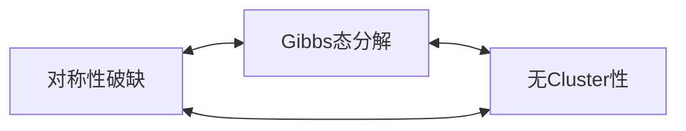

# 对称性自发破缺

在之前的内容中，已经提及过，对于 [[伊辛模型]] ，存在 スピン反転対称性
从而
$$f(h) = f(-h)$$
自由能是关于磁场的偶函数。那么，根据磁化的定义
$$
m(h) = -\pdv{f(h)}{h}
= - \pdv{f(-h)}{h} = \pdv{f(-h)}{(-h)} = -m(-h)
$$
如果这个式子成立的话，那么磁化关于磁场就是一个奇函数。然后在无磁场的时候，磁化就会是 0. 不会产生自发磁化，強磁性相がないということになります。

但是，注意到一点，自由能虽然是连续的，但不一定是解析的，也就是说
$$
-\pdv{f(h)}{h} = - \pdv{f(-h)}{h}
$$
这个等式不一定成立。上面的那个式，实际上是假定了自由能始终是解析的。但我们在之前的Lee-Yang定理里看到了，在取热力学极限后，这个解析性是会破缺的。

所以我们在实际计算，微弱磁场下的磁化，我们先要进行热力学极限，之后在取0磁场极限
$$
m(0^+) = -\lim_{h\to0^+} \pdv{f(h)}{h}
= -\lim_{h\to0^+} \pdv{h} \lim_{N\to \infty}
\frac{F(h)}{N}
$$

而如果先取磁场极限，则自然会得到自发磁化为0的结论

$$
-\lim_{N\to \infty} \lim_{h \to 0^+} \pdv{h} \frac{F(h)}{N} = 0
$$

---

像刚刚提到的一样，磁场为零的时候，如果磁化不是零，被称作自发磁化。当有外加磁场的时候，自旋对齐这件事很容易理解；而在没有磁场的时候，自旋也会为了降低自由能，而自动对齐。

由这张图很容易看出来，横轴是磁化，纵轴是自由能
![[freeEnergy.png#CENTRE|free energy|400]]
这张图有平均场近似导出，可以看出自由能是关于磁化的偶函数，但是很明显，磁化为零的状态实际是准安定的状态，横軸に対称性を持つが、明らかに $\pm 1$ の磁化を持つのがより安定になるます。これは「対称性の自発的破れ」と呼びます。

要するに、Hamiltonian が対称性を持っても、実際の状態にはその対称性を反映しないようになることがあります。対称性の自発的破れは熱力学極限において起こります。

一般的に、われわれは秩序変数で、対称性の自発的破れを表す。秩序変数のふるまいによって相の状態を区別することができる.対称、性が破れていない相を無秩序相,　破れている相を秩序相とよぶ。磁性体の場合なら、常磁性相は無秩序相で、強磁性相は秩序相です。

# 長距離秩序

秩序相、例えば、強磁性体が自発磁化するとき、全空間にわたって、秩序が保たれている。これを長距離秩序と言います。長距離秩序の存在は, 相関関数で判断できます。

相関関数というのは、異なる空間点にある変数がどれだけ関連し合っているかを示す指標となる量です。

Ising モデルの場合では、相関関数は二つのspinの積の平均値で定義されます。

$$\ev{S_iS_j}$$

二つのspinが独立であれば
$$\ev{S_iS_j} = \ev{S_i}\ev{S_j}$$
一般的に、この等式は成り立たない。

相関関数と長距離秩序の関係を見るために, $i$ と $j$ の距離を大きくしたらどうなるかを考えると、$i$ と $j$ が十分離れれば相関が小さくなり, それぞれ独立と見做せます。
$$
\lim_{h\to 0}\lim_{\abs{\vb*{r}_i - \vb*{r}_j}\to \infty} \lim_{N \to \infty}
\ev{S_iS_j}
= \qty(\lim_{h\to 0} \lim_{N\to \infty} \ev{S_i})
\qty(\lim_{h\to 0} \lim_{N\to \infty} \ev{S_j})=m^2
$$
強磁性体において、自発磁化があって、$m^2$ がゼロでない有限値になり、長距離秩序が存在することがわかります。一つめの等式は, クラスター性とよばれる性質である.

また、連結相関関数も定義できます。
$$
G_{ij} = \ev{S_iS_j} - \ev{S_i}\ev{S_j}
$$
$G_{ij}\neq 0$ であれば、相関性があります。

$\abs{\vb*{r}_i - \vb*{r}_j}\to \infty$ の極限を取れば、$G_{ij}$ 必ずゼロになる。

$$\lim_{\abs{\vb*{r}_i - \vb*{r}_j}\to \infty} G_{ij} = 0$$
連結相関関数は,式(2 . 2 9 )の磁化率の表式に現れるなど,臨界現象を記述するうえで重要な役割を果たす.

# エルゴード性の破れと純粋状態

施加正的磁场，会有正的磁化，自由能为 $F_{+}$；同样，负磁场的时候，自由能为 $F_{-}$.
$$
\frac{P_+}{P_-} = \me^{-\beta(F_+-F_-)}
$$
$$F(h) \sim F(0) - Nhm$$
无限小，正向磁场
$$
\frac{P_+}{P_-} = \me^{2N \beta hm}\to \infty
$$
取热力学极限之后，在施加正向小磁场的时候，负磁化的发生概率，相对于正的磁化，几乎未0
也就是说，在计算配分函数的时候，负磁化状态はあんまり寄与しない。これを「エルゴード性の破れ」と言います。

エルゴード性とは状態空間のすべてをくまなく探索するということである.いまの場合,対称性の自発的破れによって実現される空間が一部に制限される.

伴随着对称性破缺，产生的磁化 $m>0$ 
$$m = \ev{S_i}_+$$
同理
$$-m = \ev{S_i}_-$$
这两种状态，在磁场为0的时候，发生概率相同，这时候的平均值
$$\ev{S_i} = \frac12 \qty(
\ev{S_i}_+ + \ev{S_i}_-
) = \frac12(m-m)=0$$

このように、対称性の自発的破れが起こると、通常の平均に使われるGibbs状態は、いくつかの純粋状態に分解できます。一般式で書くと
$$
\ev{S_i} = \sum_\alpha P_\alpha m_i^\alpha,\quad m_i^\alpha = \ev{S_i}_\alpha
$$

$m_i^\alpha$ は一つの純粋状態 $\alpha$ に対し定義される磁化で、$P_\alpha$ は純粋状態の出現確率です。

---

あらわに磁場を導入しないで、対称性自発的破れを見出すためには、相関関数で考えます。

一般情况，同一个相内，足够远的两个自旋间的相关函数，体现出团块性。
$$\ev{S_iS_j} \to \ev{S_i}\ev{S_j}$$
但是，发生对称性破缺时，Gibbs态不满足这个性质
$$
\begin{align}
	\ev{S_iS_j}-\ev{S_i}\ev{S_j}
	&= \sum_\alpha P_\alpha \ev{S_iS_j}_\alpha
	-\sum_\alpha P_\alpha \ev{S_i}_\alpha
	\sum_\beta P_\beta \ev{S_j}_\beta\\
	&\to \sum_\alpha P_\alpha m_i^\alpha m_j^\alpha
	- \sum_{\alpha, \beta} P_\alpha
	P_\beta m_i^\alpha m_j^\beta
\end{align}
$$

また,自発磁化の値はG i b b s 状態の平均から次のように計算することができる.

$$\lim_{\abs{i-j}\to \infty} \ev{S_i S_j} = m^2$$
この方法では微小磁場を考えなくてよいし,状態空間を制限する必要もない.Gibbsキ  純粋状態どちらの場合でも成り立つので有用な式となる

長距離秩序を測る指標として、次の量が使われる
$$
m_2 = \ev{\qty(\frac1N \sum_{i=1}^N S_i)^2}^{1/2}
$$

この量はゼロ磁場で計算されます.　正の微小磁場の自発磁化をmとすると,m > m2を証明することができます
したがって, m2 が正の数であることがわかったら、自発磁化が存在することがわかる

強磁性イジング模型のような単純なモデルでは、純粋状態は2つしか存在せず、それぞれの状態が取る確率も等しいです。しかし一般的には、純粋状態の数が多く存在する場合や、それぞれの状態の確率が等しくない場合もあります。代表的な例としてスピンガラスがあります。この場合、無数の純粋状態が存在します。このような系に対して、対称性を破る微小な磁場を導入することは困難であり、ここでの考え方が有用な手段となります。

# 連続対称性のある系の相転移

Ising モデルにおいては、spin の方向は二つしか取れませんが、それに比べ、H e i s e n b e r g 模型ではスピン変数が3次元ベクトルで表されます。この場合、スピン反転対称性も存在し、しかも、連続対称性も存在します。

スピンの向きは連続的な値をとる.スピンがある方向に自発磁化をもっとしよう.このとき,すべてのスピンの向きをいっせいに回転してみる.どの方向を向くのも熱力学的には同じ状態であるから,スピンは容易にその方向を変える.　つまり、すべてのスピンが同じ方向に向きながら、くるくる回ることが可能です。この性質は、N a m b u - G o l d s t o n e　mode　と呼びます。

# 相転移の特徴

## 相図と熱力学関数のふるまい

## 臨界指数

